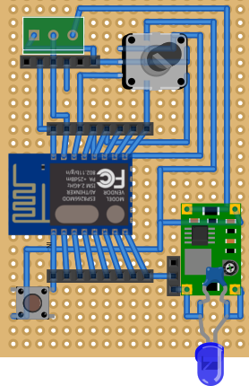

# espixelflut
This repository contains all files used in the ws2812 RGB LED pixel string built for our Christmas tree project.
It had several hardware/software iterations but the current version consists of
* a beefy (ATX) 12V power supply
* a 3v step down converter
* an ESP8266 using the i2s DMA out
* a string of 200 ws2812 RGB LEDs
* Art-Net protocol support (currently hardcoded on universe 1 and up)
* custom protocol: `PX x RRGGBB`
  * where x is a number between 0 and 200 and RR GG BB are hexadecimal values

## schematic
Note that the i2s pin used is _GPIO3_/_RX0_; any serial device connected to the ESP8266 might not like data coming from the RX port.
The blue LED is to prevent voltage spikes that definitely destroys the ESP (buck converter is rated too high).

## chrome
This subsirectory contains plugin directories to run a chrome app:
* ColorFlut: can set a custom gradient on the LED string
* FlutArt: can set an animating pattern on the LED string

To install
* go to te chrome (hamburger) menu, _More tools_, _Extensions_.
* enable _Developer mode_
* drag one of the subdirectories inside the `chrome` directory on top of the _Extensions_ tab
* go to the apps tab or navigate to chrome://apps
* run the app

## python
This subsirectory contains several scripts to control the LED string:
* All `ACKtree_*.py` files use the `ChristmasTree.py` custom protocol library
* All `flutnet-*.py` files use the `lib/StupidArtnet.py` Art-Net protocol library

## swift-ios
This subdirectory contains an attempt to implement an iOS app.
Currently, no UDP transmission is implemented and needs work.
